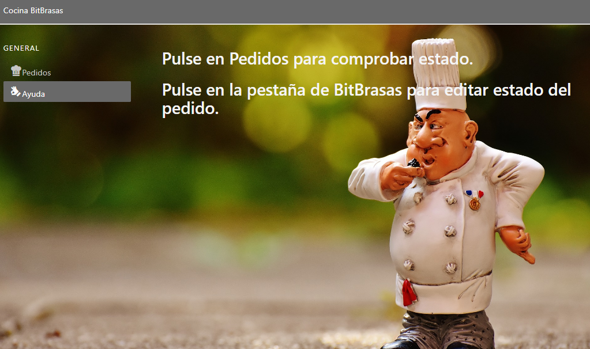
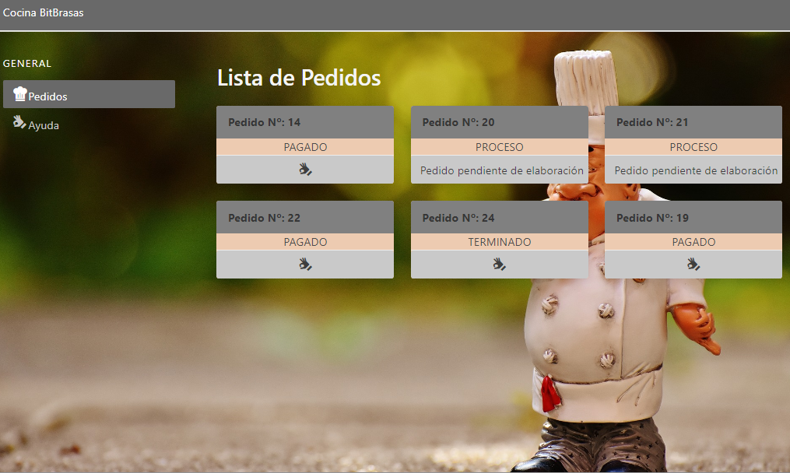
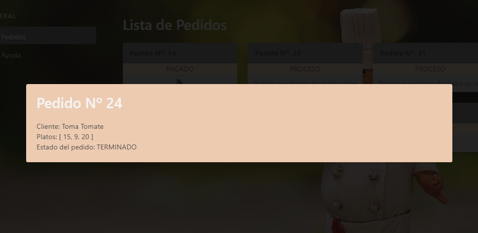

# Cliente SPA para la API de pedidos con Nuxt.js
> Cliente para la API de pedidos creada con Django Rest Framerwork con el que completo el proyecto [WebRestaurante](https://github.com/carlos4Dev/WebRestaurante)

Se ha creado utilizando **Nux.js** y el *framework* **Buefy**.

## Capturas
Pantalla de ayuda

Lista de Pedidos, mostrando los diferentes estados.

Detalle del pedido seleccionado.

